# Sleepee Inc. - Tugas Besar 1 - BondoMan


## Deskripsi Aplikasi

Aplikasi yang bernama Bondoman ini merupakan aplikasi manajemen aplikasi yang membolehkan penggunanya melakukan manajemen transaksi, yakni penambahan, pengubahan, dan penghapusan data transaksi. Transaksi memiliki atribut berupa judul, harga, tanggal, kategori ("Pemasukan" atau "Pengeluaran") dan lokasi pengguna. Lokasi di-_update_ secara otomatis saat aplikasi dibuka, dan pengguna dapat mengubah lokasi tersebut saat menambah/mengedit transaksi di daftar transaksi. Pengguna dapat mengakses Google Maps berdasarkan lokasi tersebut.

Pengguna juga mampu melakukan scan nota melalui kamera aplikasi atau galeri. Hasil scan akan menghasilkan dummy data transaksi yang ditambahkan ke daftar transaksi. Terdapat graf yang menunjukkan porsi transaksi berdasarkan kategorinya. Pengguna dapat menyimpan daftar transaksi dalam bentuk file XLS/XLSX, mengirim daftar transaksi dalam Gmail dengan attachment file XLS/XLSX, dan membuat transaksi acak.

Pengguna perlu login ke dalam akun yang telah ditentukan untuk menggunakan aplikasi. Waktu penggunaan aplikasi setelah login adalah maksimum 5 menit sebelum pengguna perlu melakukan login lagi. Pengguna akan diberikan JWT yang akan kadaluwarsa setelah 5 menit. Aplikasi dapat mengecek apakah kondisi hp saat ini tersambung dengan internet. Walaupun tanpa internet, aplikasi dapat dibuka, akan tetapi aplikasi tidak bisa melakukan permintaan dan penarikan data dari server.

## Library yang Digunakan

- Google ML Kit (Scan)
- Retrofit (API)
- KSP (Room)
- FusedLocationProviderClient (Get Current Location)
- Geocoder
- JSoup (Santizing Input)
- OtaliaStudios (Twibbon)
- Google Play Services Maps (Google Map Intent)
- Apache POI (XLS/XLSX)
- https://github.com/PhilJay/MPAndroidChart (Graf)
- Splash Screen API

## OWASP
- M4 (**Insufficient Input/Output Validation**): Input pengguna pada aplikasi mobile dapat menyebabkan berbagai vulnerabilitas keamanan yang berbahaya, baik bagi stabilitas aplikasi, maupun data pengguna. Aplikasi ini memiliki input pengguna saat menambahkan/mengedit transaksi, dan hal ini dapat menjadi berbahaya saat dieksploitasi melalui hal-hal seperti cross-site scripting (XSS). XSS adalah eksploitasi keamanan di mana penyerang menempatkan malicious client-end code ke laman web. Misalnya, penyerang memasukkan ```<p><a href='http://example.com/' onclick='stealCookies()'>Link</a></p>``` pada input transaksi, hal ini akan mengambil cookie dari pengguna yang sedang login. Untuk mencegahnya, kami menggunakan Jsoup untuk mensanitasi input pengguna memakai Safelist dari library tersebut, sehingga hasil inputnya menjadi ```<p><a href="http://example.com/" rel="nofollow">Link</a></p>```.
- M9 (**Insecure Data Storage**): Penyimpanan data seperti token pengguna dapat berbahaya bagi pelaku kejahatan yang dapat mengambil data berharga tanpa otorisasi. Token pengguna yang disimpan di SharedPreferences dapat dicuri jika tidak diamankan dengan baik. Oleh karena itu, kami menggunakan enkripsi/dekripsi token. Saat token diinisialisasi melalui login, token dienkripsi menggunakan Advanced Encryption Standard (AES). Token diiterasi sebanyak 10000 kali menggunakan kunci base64, salt, dan Initialization Vector (IV). Token yang sudah dienkripsi disimpan dalam SharedPreferences. Jika token ingin diambil untuk kegunaan aplikasi, token didekripsi dengan kunci, salt, dan IV yang sama.

## Screenshot Aplikasi

<table style="padding:10px">
    <tr>
        <td>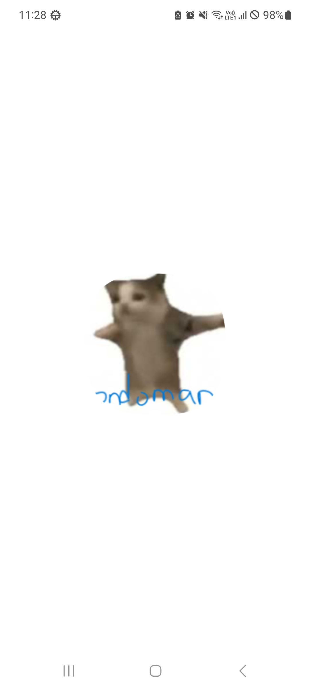</td>
        <td>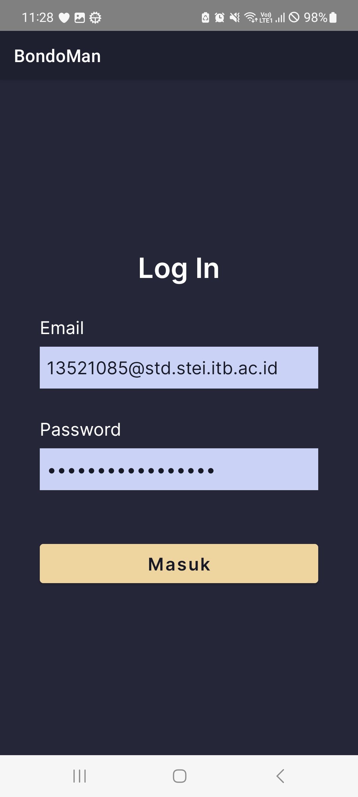</td>
        <td>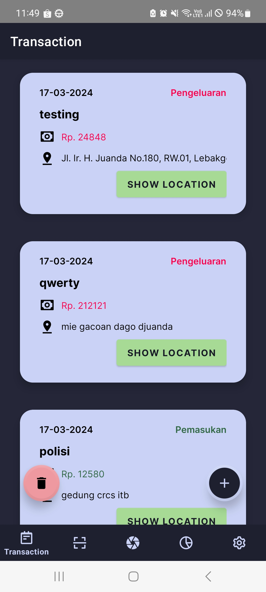</td>
    </tr>
    <tr>
        <td>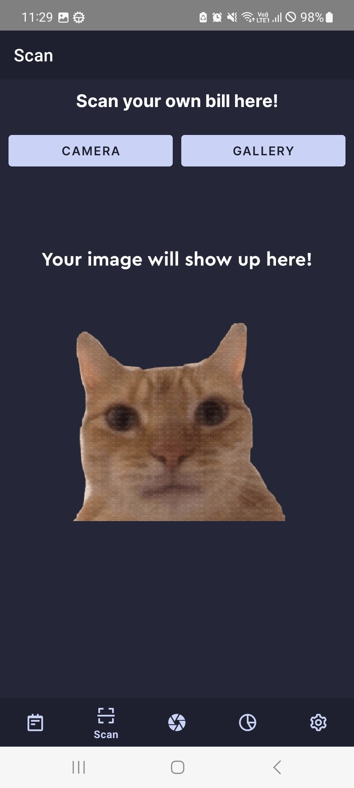</td>
        <td>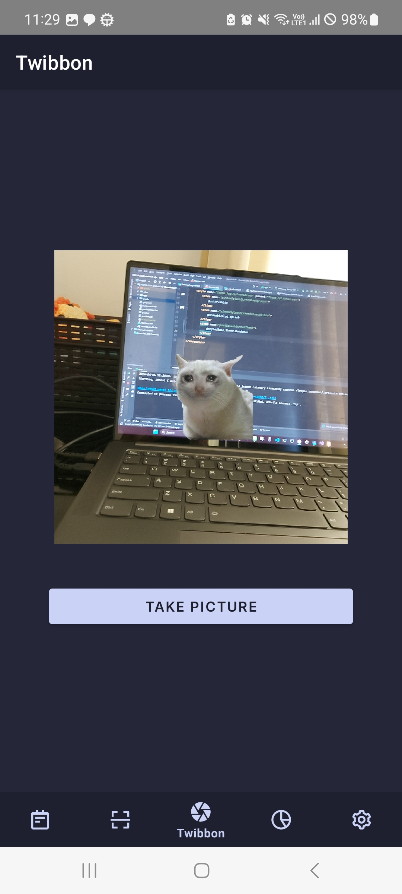</td>
        <td>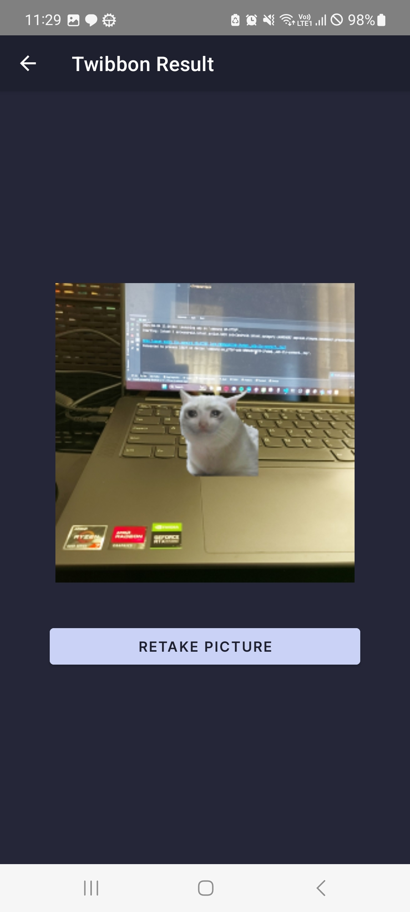</td>
    </tr>
    <tr>
        <td>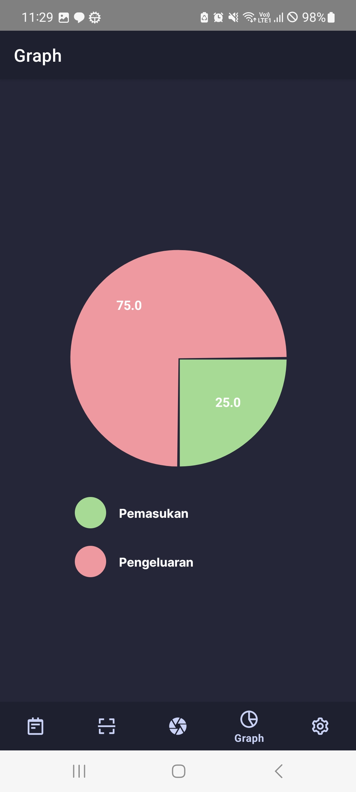</td>
        <td>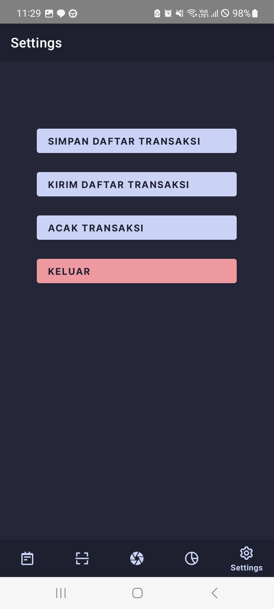</td>
        <td>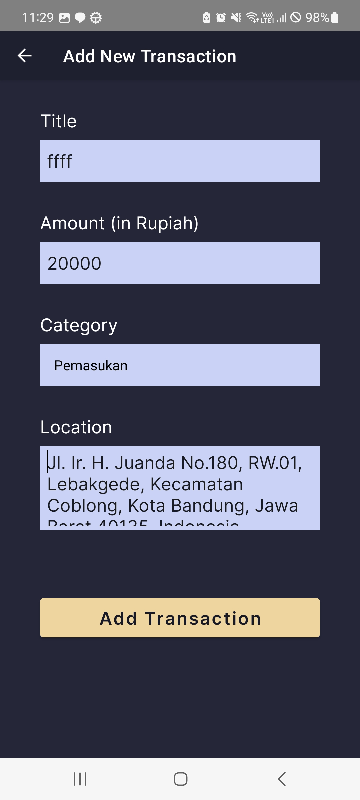</td>
    </tr>
    <tr>
        <td>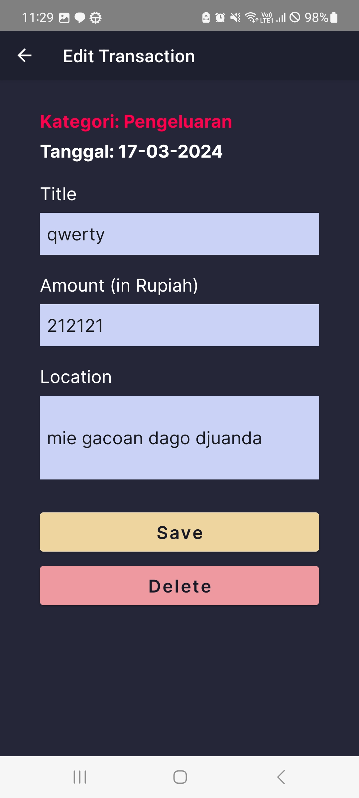</td>
        <td>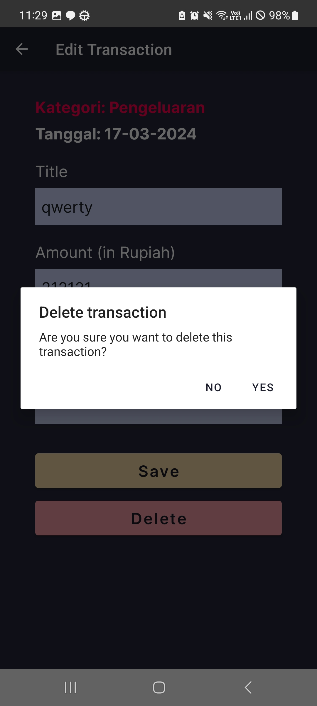</td>
        <td>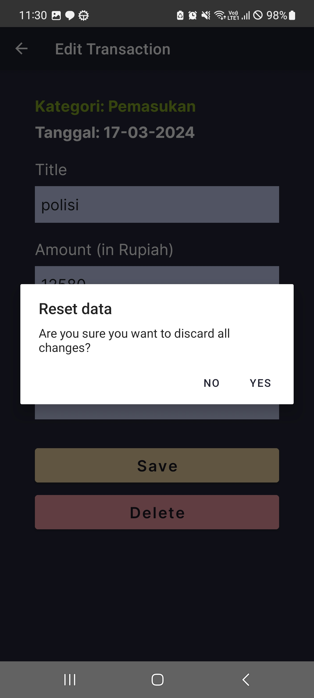</td>
    </tr>
    <tr>
        <td>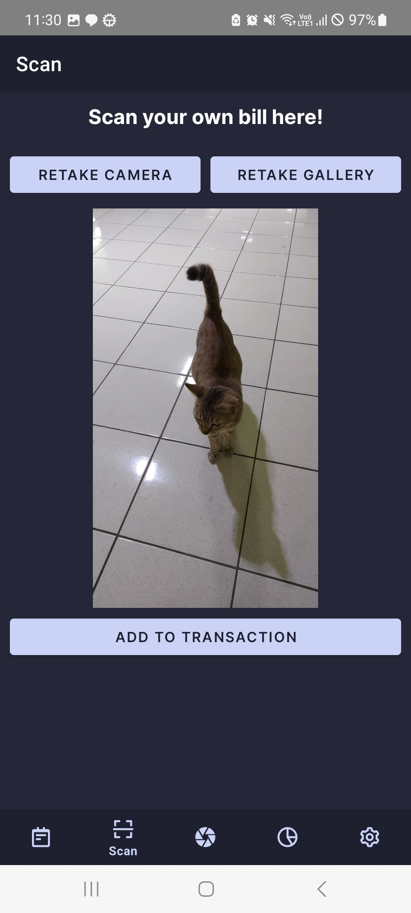</td>
        <td>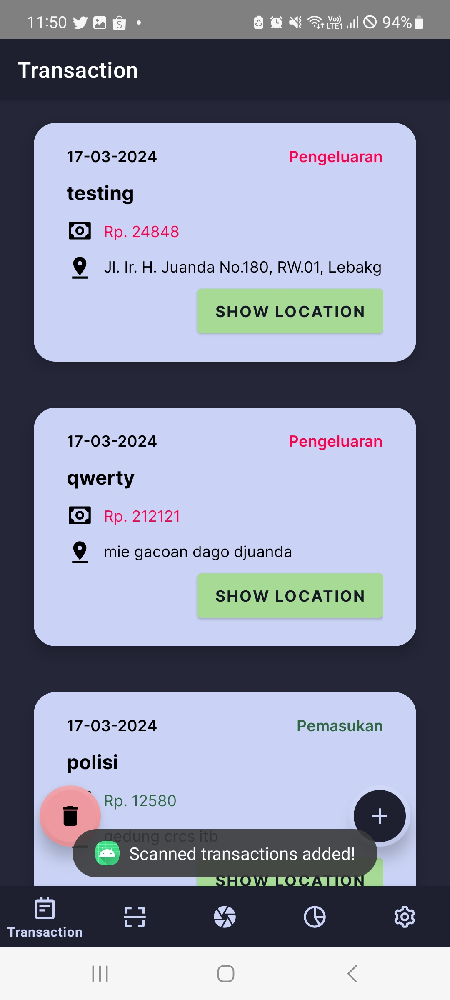</td>
        <td>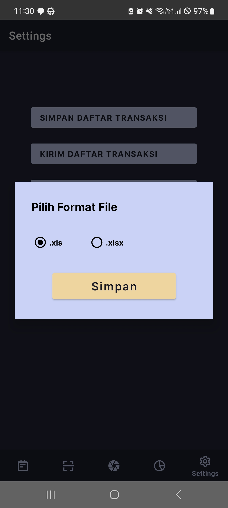</td>
    </tr>
    <tr>
        <td>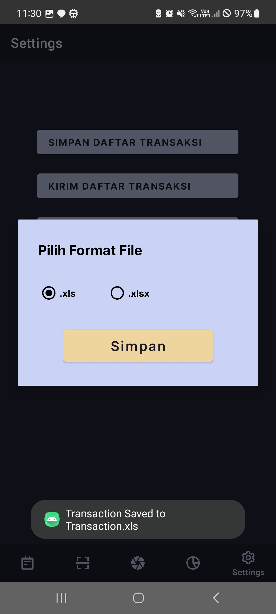</td>
        <td></td>
        <td>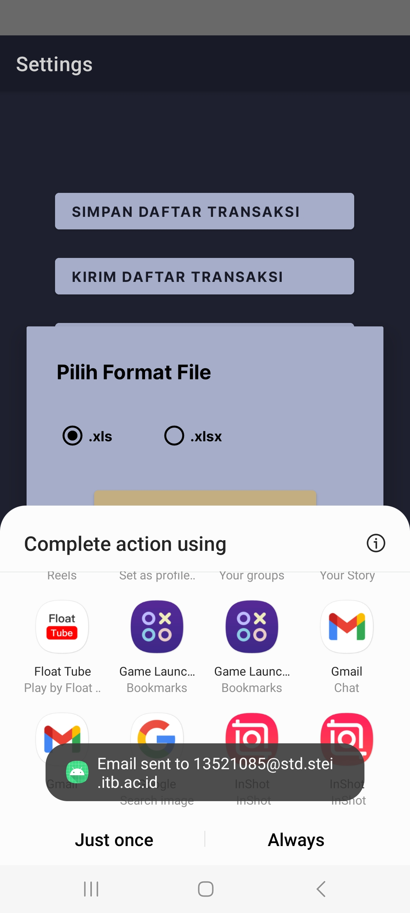</td>
    </tr>
    <tr>
        <td>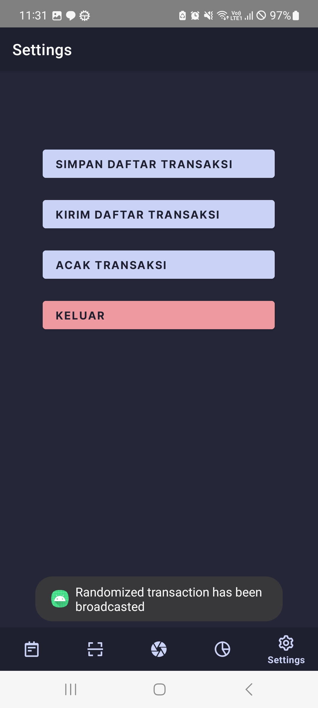</td>
        <td>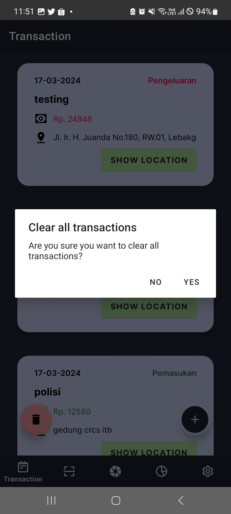</td>
        <td>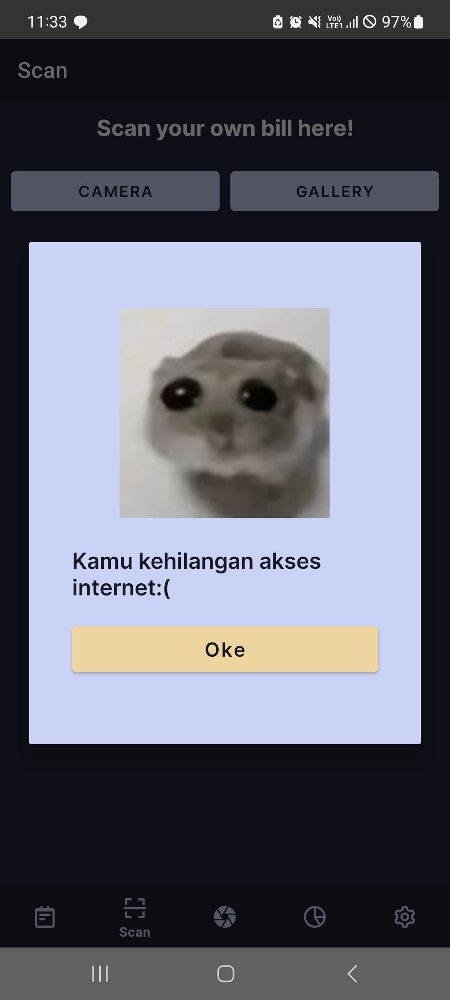</td>
    </tr>
    <tr>
        <td>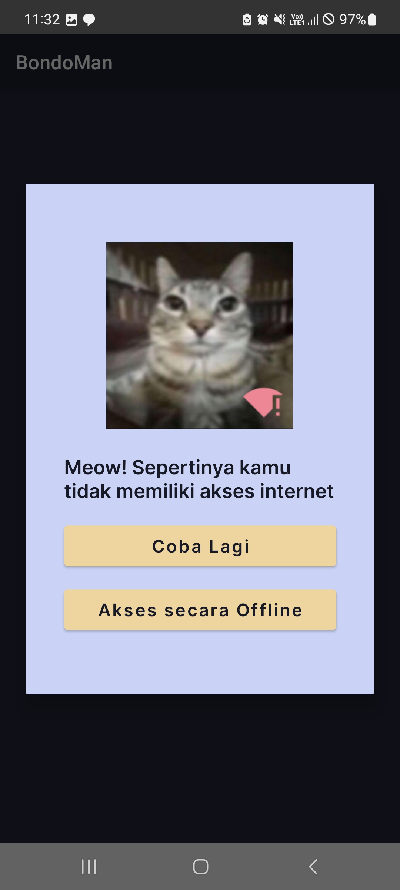</td>
    </tr>

</table>

## Pembagian Kerja Kelompok

| Nama                        | NIM      | Pembagian Kerja                                                                   |
|-----------------------------|----------|-----------------------------------------------------------------------------------|
| Adam Dharma Sakti           | 10023359 | Header                                                                            |
| Muhammad Equilibrie Fajria  | 13521047 | Graf transaksi, simpan transaksi dalam XLS/XLSX, intent Gmail, broadcast receiver |
| M Farrel Danendra Rachim    | 13521048 | Navbar, CRUD Transaksi, daftar transaksi, scan nota, Twibbon, OWASP               |
| Addin Munawar Yusuf         | 13521085 | Login, logout, background service, network sensing                                |

## Jumlah Jam Persiapan

| Nama                        | NIM      | Jumlah Jam Persiapan/Pengerjaan |
|-----------------------------|----------|---------------------------------|
| Adam Dharma Sakti           | 10023359 | 1 jam                           |
| Muhammad Equilibrie Fajria  | 13521047 | 25 jam                          |
| M Farrel Danendra Rachim    | 13521048 | 30 jam                          |
| Addin Munawar Yusuf         | 13521085 | 25 jam                          |